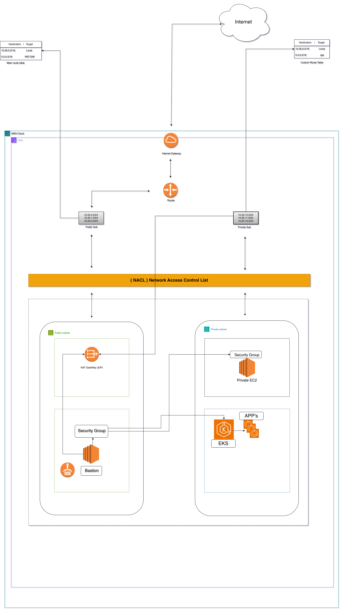
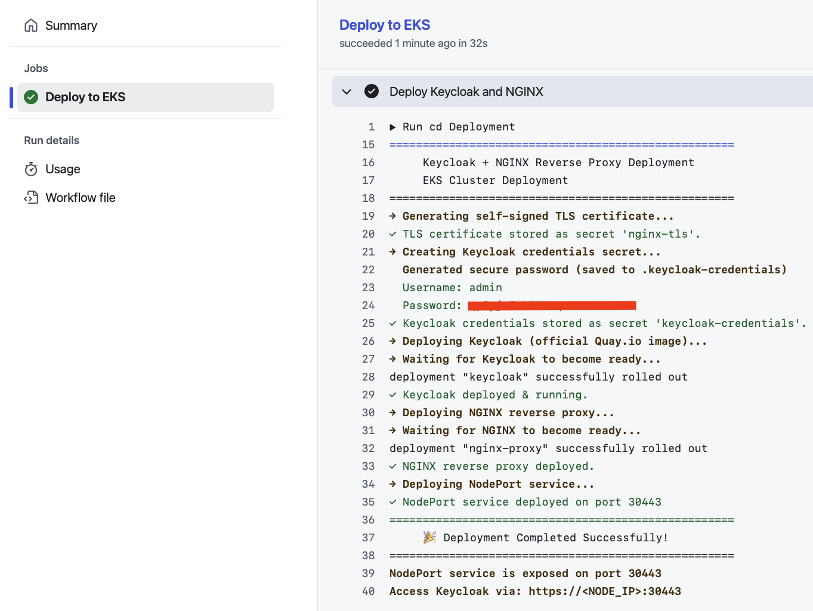
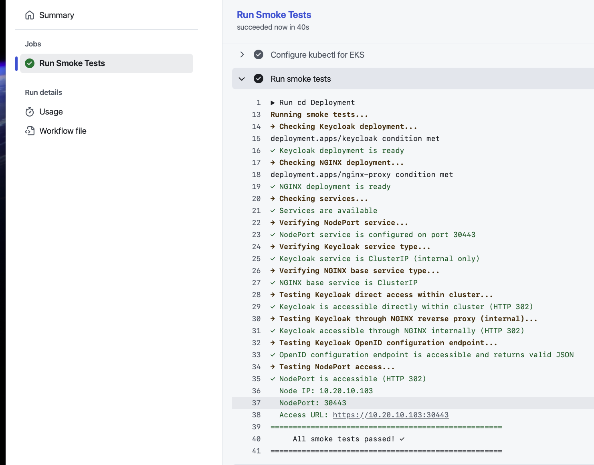

# AWS EKS Keycloak + NGINX Platform

This repository provisions an end-to-end AWS environment for deploying **Keycloak** behind an **NGINX reverse proxy** on EKS. Terraform builds the network and compute foundation (VPC, EKS, IAM, ECR, KMS), while GitHub Actions automates Docker image builds and Kubernetes deployments.

---

## Highlights

- **Modular Terraform** (under `Infra/`) creates VPC, Bastion host, EKS cluster, ECR, and KMS resources.
- **Keycloak + NGINX** deployment on EKS with TLS termination and NodePort exposure.
- **CI/CD** via GitHub Actions builds Docker images and deploys to EKS using GitHub OIDC to assume AWS roles.

---

## Terraform Infrastructure

| Module | Purpose | Key Outputs |
| ------ | ------- | ----------- |
| `vpc` | Dedicated VPC with 3× public + 3× private subnets, IGW, NAT gateways |
| `bastion_ec2` | Public EC2 instance for SSH/SSM access to private subnets |
| `eks` | Private EKS cluster with managed node group, IRSA support, GitHub Actions IAM role |
| `kms` | Customer-managed KMS key for encryption |
| `ecr` | Repository for container images |

Remote state is stored in the S3 bucket defined in `terraform { backend "s3" … }`.

### Running Terraform (perf environment)

```bash
cd Infra
terraform init -var-file=envs/perf.auto.tfvars
terraform plan -var-file=envs/perf.auto.tfvars
terraform apply -var-file=envs/perf.auto.tfvars
```

---

## Repository Layout

```
Infra/
├── envs/                   # perf, qa, prod tfvars
├── modules/                # bastion_ec2, eks, vpc, kms, ecr
├── main.tf                 # module composition
├── variables.tf            # global var definitions
├── outputs.tf              # outputs consumed by CI/CD and operators
└── provider.tf             # AWS provider + backend configuration

Deployment/
├── manifests/              # Kubernetes manifests
│   ├── keycloak.yaml
│   ├── nginx-deployment.yaml
│   ├── nginx-config.yaml
│   └── nginx-service-nodeport.yaml
├── deploy.sh               # Deployment script
└── smoke-test.sh           # Smoke test script

.github/workflows/
├── docker-ecr.yml          # Build + push image to ECR
├── deploy-eks.yml          # Deploy to EKS cluster
└── smoke-test.yml          # Run smoke tests
```

---

## Deployment Architecture

```
┌───────────────────────────┐
│         Client            │
│   (via NodePort)          │
└───────────────┬───────────┘
                │  HTTPS (TLS)
                ▼
       ┌───────────────────┐
       │   NGINX           │
       │   Reverse Proxy   │
       │  (TLS terminated) │
       │   NodePort:30443  │
       └─────────┬─────────┘
                 │ HTTP (internal only)
                 ▼
         ┌─────────────────┐
         │    Keycloak     │
         │    ClusterIP    │
         │  Internal Only  │
         └─────────────────┘
```

---

## CI/CD Workflow

1. **Docker build** 🛠️ (`docker-ecr.yml`)
   - Uses GitHub Actions OIDC to assume AWS IAM role
   - Builds Docker images (if custom images are needed)
   - Pushes to ECR repository

2. **Deploy to EKS** 🚀 (`deploy-eks.yml`)
   - Configures kubectl for EKS cluster
   - Deploys Keycloak and NGINX manifests
   - Verifies deployment

3. **Smoke Tests** 🧪 (`smoke-test.yml`)
   - Validates deployments are ready
   - Verifies service types (ClusterIP for Keycloak, NodePort for NGINX)
   - Tests internal connectivity and NodePort access
   - Validates OpenID configuration endpoint

---

## Manual Deployment

### Prerequisites

- `kubectl` configured to connect to your EKS cluster
- `openssl` for TLS certificate generation

### Deploy

```bash
cd Deployment
./deploy.sh
```

The script will:
1. Generate self-signed TLS certificate
2. Create Keycloak credentials secret
3. Deploy Keycloak (ClusterIP service)
4. Deploy NGINX reverse proxy (ClusterIP service)
5. Deploy NodePort service (exposes NGINX on port 30443)

### Custom Credentials

Set environment variables before running:

```bash
export KEYCLOAK_ADMIN=myadmin
export KEYCLOAK_ADMIN_PASSWORD=mypassword
./deploy.sh
```

### Run Smoke Tests

```bash
./smoke-test.sh
```

The smoke test validates:
- Deployments are ready
- Services are configured correctly (Keycloak: ClusterIP, NGINX: NodePort)
- Keycloak is accessible internally
- NGINX reverse proxy forwards to Keycloak
- NodePort is accessible
- OpenID configuration endpoint is working

---

## Accessing Keycloak

### Option 1: Port Forwarding (Recommended for Remote Access)

Since EKS nodes are deployed in private subnets, use `kubectl port-forward` to access Keycloak from your local machine:

```bash
kubectl port-forward service/nginx-proxy-nodeport 30443:443
```

Then open in your browser:
```
https://localhost:30443
```
(Accept the self-signed certificate warning)

Or test with curl:
```bash
curl -k https://localhost:30443
```

### Option 2: Via NodePort (From Within AWS VPC)

If you're accessing from within the AWS VPC (e.g., from the bastion host), you can access directly via NodePort:

1. Get the node's private IP:
   ```bash
   kubectl get nodes -o wide
   ```

2. Access Keycloak from within VPC:
   ```bash
   curl -k https://<NODE_PRIVATE_IP>:30443
   ```

**Note:** EKS nodes are in private subnets and don't have public IPs, so direct external access isn't possible without port-forwarding or a load balancer.

### Internal Access (from within cluster)

Keycloak is accessible internally via NGINX:
```bash
kubectl run test-curl --rm -i --restart=Never --image=curlimages/curl -- \
  curl -k https://nginx-proxy.default.svc.cluster.local/realms/master/.well-known/openid-configuration
```

---

## Database Configuration

**Keycloak Database Options:**

1. **Embedded H2 (Default)** - Current configuration uses `start-dev` mode with embedded H2 database
   - ✅ No RDS needed
   - ✅ Simple setup
   - ⚠️ Not suitable for production (Done for assigment only)

2. **External PostgreSQL/MySQL (Production)** - Use RDS for persistent storage
   - Enable RDS in `Infra/envs/*.auto.tfvars` by setting `enable_rds = true`
   - Configure Keycloak to connect to RDS (requires updating Keycloak deployment with DB connection settings)
   - Provides persistent storage, backups, and high availability

**Current Setup:** RDS is **disabled by default** since Keycloak uses embedded H2. Enable RDS only if you need production-grade database persistence.

---

## Security Notes

- Keycloak is **internal only** (ClusterIP service, not exposed externally)
- NGINX terminates TLS and forwards to Keycloak over HTTP internally
- NodePort exposes NGINX to external traffic on port 30443
- Keycloak credentials are stored in Kubernetes secrets
- Self-signed certificates are used for development; use cert-manager or AWS Certificate Manager for production
- Ensure security groups allow inbound traffic on port 30443 from trusted sources

---

## Cleanup

```bash
kubectl delete -f Deployment/manifests/
kubectl delete secret nginx-tls keycloak-credentials
```

---

## Troubleshooting

### Check NodePort Service

```bash
kubectl get service nginx-proxy-nodeport
kubectl get service nginx-proxy-nodeport -o yaml
```

### Check Pod Logs

```bash
kubectl logs -l app=keycloak
kubectl logs -l app=nginx-proxy
```

### Test Internal Connectivity

```bash
# Test Keycloak directly
kubectl run test-keycloak --rm -i --restart=Never --image=curlimages/curl -- \
  curl -s http://keycloak.default.svc.cluster.local:8080

# Test NGINX to Keycloak
kubectl run test-nginx --rm -i --restart=Never --image=curlimages/curl -- \
  curl -k https://nginx-proxy.default.svc.cluster.local
```

### Verify NodePort Access (From Within VPC)

```bash
# Get node private IP (nodes are in private subnets)
NODE_IP=$(kubectl get nodes -o jsonpath='{.items[0].status.addresses[?(@.type=="InternalIP")].address}')
NODEPORT=30443

# Test from within cluster/VPC only
kubectl run test-nodeport --rm -i --restart=Never --image=curlimages/curl -- \
  curl -k https://$NODE_IP:$NODEPORT
```

### Access via Port Forwarding

For remote access from your local machine:

```bash
# Forward port 30443 to NodePort service
kubectl port-forward service/nginx-proxy-nodeport 30443:443

# In another terminal, test access
curl -k https://localhost:30443
```

## Screenshots




